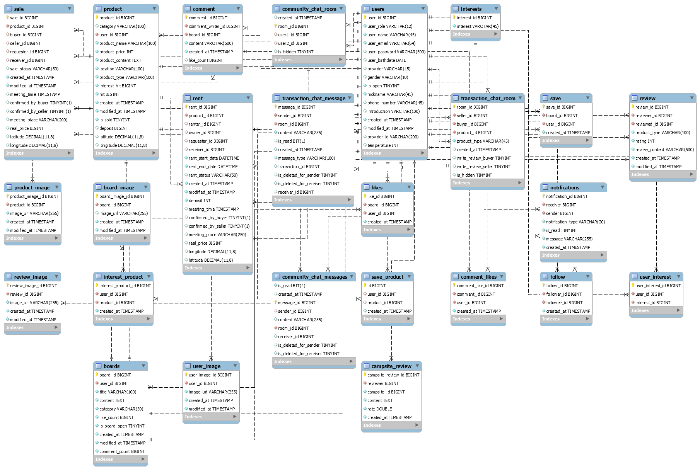
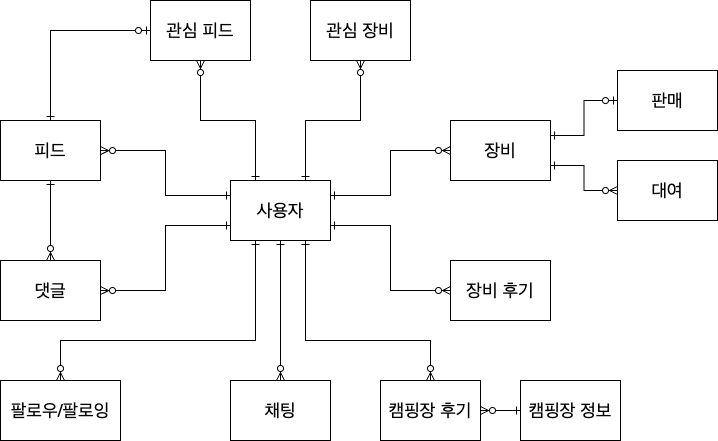
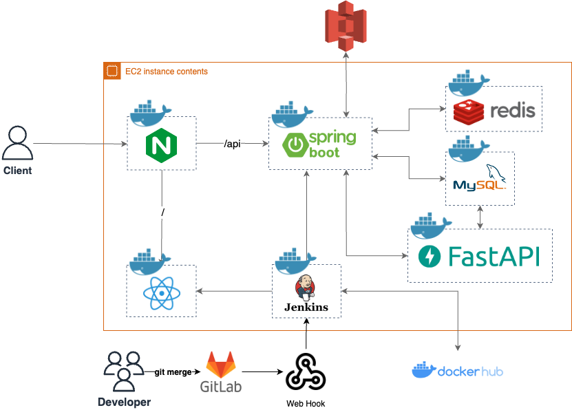
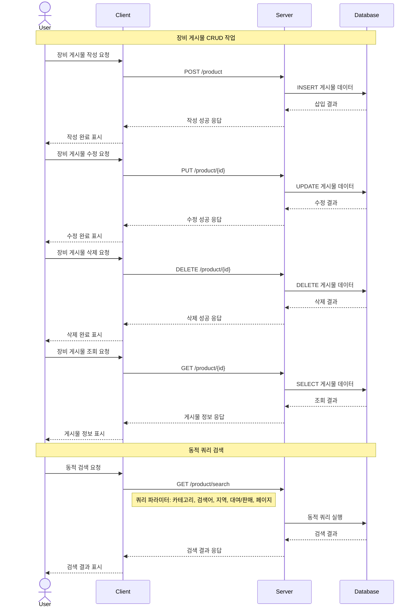
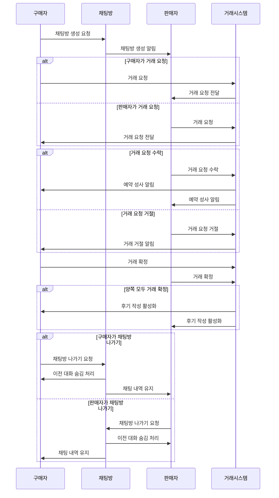

# CampForest

***CampForest***는 캠핑을 사랑하는 모든 이들을 위한 플랫폼입니다. 저렴한 장비 대여, 장비를 통한 재테크, 캠핑장에 대한 신뢰성 있는 정보 제공, 그리고 캠퍼들 간의 활발한 정보 교류를 통해 더 즐겁고 경제적인 캠핑 문화를 즐겨보세요!

# ERD

### 도식화

# System Architecture

# Sequence Diagram

## 장비 게시글 작성

## 사용자 장비 거래

# 주요 기능

## 🗣️ 커뮤니티

### 1. 피드

> 장비 후기, 레시피 추천, 캠핑장 양도, 자유게시판, 질문 게시판 카테고리 별로 원하는 피드를 작성하고 사람들과 소통할 수 있어요!
> 

### 2. 팔로우/팔로잉

> 원하는 사용자를 팔로우하고 주기적으로 게시글을 확인할 수 있어요!
> 

### 3. 채팅

> 다양한 사람들과 직접 채팅을 통해 정보를 공유할 수 있어요!
> 

## ⛺️ 장비 대여/거래

### 1. 장비 대여

> 캠핑 한 번을 위해 캠핑 장비를 구입하기 부담되지 않나요? 혹은, 집에 방치되어 있는 캠핑 장비를 효율적으로 활용하고 싶으신가요? 원하는 캠핑 장비를 찾아보고 대여해보세요!
> 

### 2. 장비 판매

> 이제는 필요 없어진 나의 캠핑 장비를 판매해보세요!
> 

## 🔎 캠핑장 검색&후기

### 1. 캠핑장 검색

> 주변 시설, 반려동물 동반 여부 등 원하는 조건과 함께 나에게 맞는 최적의 캠핑장을 검색해보세요!
> 

### 2. 캠핑장 후기

> 방문했던 캠핑장에 대한 후기를 남기고, 가고 싶은 캠핑장의 후기를 미리 확인해보세요!
>